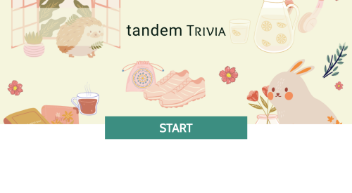
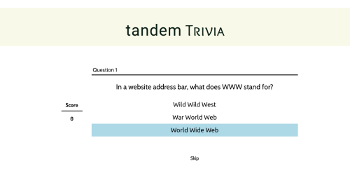
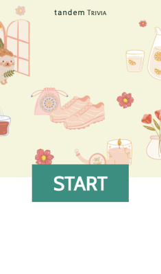

# Tandem Code Challenge - Trivia

## The Code Challenge
The goal of the code challenge was to create any type of a trivia app.

Assumptions
* A round of trivia has 10 Questions
* All questions are multiple-choice questions
* Your score does not need to update in real time
* Results can update on form submit, button click, or any interaction you choose
* We will provide you with the trivia data such as the questions, correct and incorrect answers via a JSON file.

Acceptance Criteria
* A user can view questions.
* Questions with their multiple choice options must be displayed one at a time. Questions should not repeat in a round.
* A user can select only 1 answer out of the 4 possible answers.
* The correct answer must be revealed after a user has submitted their answer A user can see the score they received at the end of the round
- - - -
## Brief Introduction of the Trivia App
* Built with ReactJS and create-react-app(CRA)
* Sass was used for writing CSS
* Jest/React testing library built with CRA were used for the unit/component testing
- - - -
## How to run the app 
To run/test the app:
1. git clone repo
2. npm install
3. npm test 
4. npm start  

Dependencies:  React: ^17.0.1
- - - -
## App funtionalities
* User can click the 'start' button on first page which renders the first questions and answer choices  

* User can  click on the 'answer choice' 
    * It will show correct and incorrect answers
    * If user selected the correct answer score will increase by 1
* User can see the updated score as the correct answer is shown  

    

* User can click on any 'answer choices' or 'next question' button on the answer page to proceed
* User can skip a question by clicking on the 'skip' button
    * Score point will not increase if question is skipped  

  
  

* User can click on a 'complete' button once all 10 questions are answered
    * Complete button will render a review page
* User can review all the previous 10 questions, correct answers, and selected answer choices
* User can click on a 'new round' button to return to the first page
    * User will receive new random set of 10 questions on start  

  

- - - -
## UI/UX designs
### Mobile Responsive Design

### UX choices 
* User has two methods to see the answer
    * click an answer choice
    * click skip button 
* User has two methods to see the next question
    * click an answer choice (while correct answer is showing)
    * click question button 
* Live updates of the scores
* Review previous questions and answer choices for studying
* Clickable buttons have changed background colors and pointer cursor on hover 
* Consistent placement of header and score components 
### UI choices 
* Clean, simple design
* Low-saturation hues for less distraction 
* Easy-to-read fonts
* Soft, light hand drawn style images for positive feelings
* Background image was created by the author on canva.com

- - - -
## Additional features I would like to add
* Tracking scores of multiple sessions for the user to show on graph
* Data table on correct answer rates of each question
* Different levels of questions and varying scores per level
* Images
* Dynamic, interactive UI components 